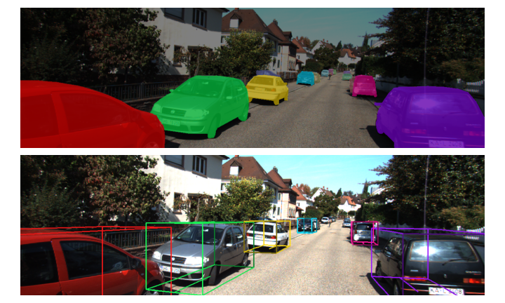

# KITTI3D Instance Segmentation DevKit

Welcome to the devkit of the [KITTI3D](http://www.cvlibs.net/datasets/kitti/eval_object.php?obj_benchmark=3d) Instance Segmentation annotations.



The instance segmentation annotations, which are matched to the already annotated 3D bounding boxes of the KITTI3D dataset,  are proveded as part of the paper:
    [MonoCInIS: Camera Independent Monocular 3D Object Detection using Instance Segmentation](https://openaccess.thecvf.com/content/ICCV2021W/3DODI/papers/Heylen_MonoCInIS_Camera_Independent_Monocular_3D_Object_Detection_Using_Instance_Segmentation_ICCVW_2021_paper.pdf)

This repository contains some info on the annotation format and example code for visualising the instances.


## Annotation format

For every image of the KITTI3D dataset (7481 training images), we **manually annotated** all **vehicle** and **pedestrian instances**.
The annotations are provided as single channel `.png` files, where the pixels of each instance have a unique id.
To link each instance to its corresponding KITTI3D bounding box, we use following convention:

| ID        | CLASS        |
| :-------- | :----------- |
| 0         |  **Background**  | 
| 1000-1999 |  **Vehicle** which is linked to a 3D bbox. <br> (The number ID%1000 is the line number of the bbox.txt annotation.)| 
| 2000-2999 |  **Pedestrian** which is linked to a 3D bbox. <br> (The number ID%1000 is the line number of the bbox.txt annotation.)| 
| 3000-3999 |  Vehicle or pedestrian which has **no 3D bbox** annotation.| 


## Download

Download the original dataset from the [official KITTI website](http://www.cvlibs.net/datasets/kitti/eval_object.php?obj_benchmark=3d).
Download our instance segmentation annotations [here](https://github.com/HeylenJonas/KITTI3D-Instance-Segmentation-Devkit/raw/main/data_object_instance_2.zip) (15MB).


## Usage

To get you started, we provide some example code to load and visualise our instance annotations and the corresponding bbox annotations.

Check out the provided [IPython Notebook](Visualise_instances.ipynb) to visualise our annotations.


## Paper

If you find these annotations useful, please cite our paper:

[MonoCInIS: Camera Independent Monocular 3D Object Detection using Instance Segmentation](https://openaccess.thecvf.com/content/ICCV2021W/3DODI/papers/Heylen_MonoCInIS_Camera_Independent_Monocular_3D_Object_Detection_Using_Instance_Segmentation_ICCVW_2021_paper.pdf)

*Jonas Heylen, Mark De Wolf, Bruno Dawagne, Marc Proesmans, Luc Van Gool, Wim Abbeloos, Hazem Abdelkawy, Daniel Olmeda Reino*

```
@inproceedings{heylen2021monocinis,
  title={MonoCInIS: Camera Independent Monocular 3D Object Detection using Instance Segmentation},
  author={Heylen, Jonas and De Wolf, Mark and Dawagne, Bruno and Proesmans, Marc and Van Gool, Luc and Abbeloos, Wim and Abdelkawy, Hazem and Reino, Daniel Olmeda},
  booktitle={Proceedings of the IEEE/CVF International Conference on Computer Vision},
  pages={923--934},
  year={2021}
}
```


## License

<a rel="license" href="http://creativecommons.org/licenses/by-nc-sa/4.0/"></a><br />This work is licensed under a <a rel="license" href="http://creativecommons.org/licenses/by-nc-sa/4.0/">Creative Commons Attribution-NonCommercial-ShareAlike 4.0 International License</a>.
